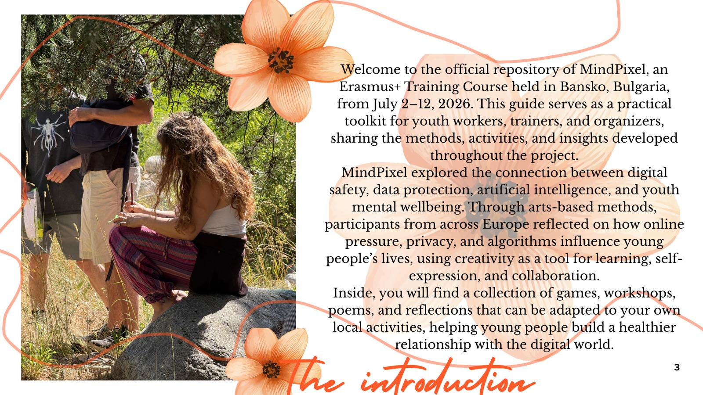

---
tags:
  - welcome
  - introduction
  - about
type: page
---

[[2. Table of contents]]

Welcome to the official repository of **MindPixel**, an Erasmus+ Training Course that took place in the serene mountains of **Bansko, Bulgaria**, from **July 2nd to 12th, 2026**. This guide is designed to serve as a practical toolkit for future youth workers, trainers, and organizers, capturing the methodologies, activities, and insights developed during our time together.

As digital technologies increasingly shape the daily lives of young people, youth work faces urgent new questions. MindPixel was born out of the need to explore the intersection of **digital safety, data protection, artificial intelligence, and youth mental wellbeing**. Throughout the project, an international team of European youth workers, educators, leaders, and artists came together to examine how online pressure, privacy concerns, and algorithmic influences affect our mental health.

What made MindPixel truly unique was its approach: instead of relying on dry lectures, we tackled these complex digital dilemmas through **creative, arts-based methods**. Art became our primary tool for reflection, emotional expression, and collaboration.

Within this guide, you will find a curated collection of the games, poems, workshops, and reflections utilized during the training course. We invite you to adapt, remix, and implement these resources in your own local contexts to help the next generation navigate modern digital life with a healthy, balanced mind.

---

## 🗺 Explore the Toolkit

  <a href="2.%20Table%20of%20contents.html" class="rm-card">
    🧭
    <strong>Foundations</strong>
    <small>Welcome, How to Use &amp; the central Table of Contents</small>
  </a>
  <a href="Days/01.%20Day%201%20%E2%80%94%20Common%20Ground%20%26%20Connections.html" class="rm-card">
    📅
    <strong>The Journey</strong>
    <small>8 daily logs chronicling the training course</small>
  </a>
  <a href="Games/Energizers%20-%20Games.html" class="rm-card">
    🎲
    <strong>Games</strong>
    <small>10 icebreakers, energizers &amp; group activities</small>
  </a>
  <a href="Workshops/WorkShops.html" class="rm-card">
    🛠️
    <strong>Workshops</strong>
    <small>8 creative, hands-on facilitation sessions</small>
  </a>
  <a href="The%20Daily%20Rhythm.html" class="rm-card">
    🌊
    <strong>Daily Rhythm</strong>
    <small>The predictable structure that grounded us</small>
  </a>
  <a href="Poems/Poems%20Corner.html" class="rm-card">
    🎨
    <strong>Culture &amp; Art</strong>
    <small>Poems, participants &amp; collective creative output</small>
  </a>

  <a href="roadmap.html" class="welcome-btn">🗺 Explore the Roadmap</a>
  <a href="graph.html" class="welcome-btn">🕸 Open the Graph</a>
  <a href="search.html" class="welcome-btn">🔍 Search the Toolkit</a>

