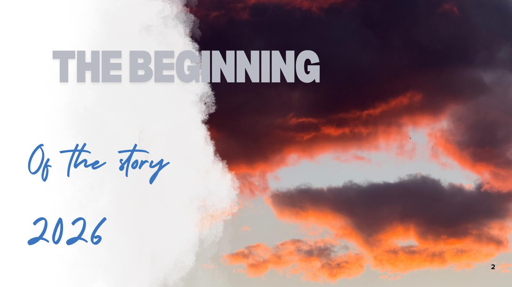

---
tags:
  - hub
  - navigation
  - index
type: hub
---

### 🧭 Foundations
* [[3.How to Use This Toolkit]]
* [[2. Table of contents]]

***

### 📅 The Daily Logs
* [[01. Day 1 — Common Ground & Connections]]
* [[02. Day - Turning Inward - Beyond the Digital Facade]]
* [[03. Day - Layers of Exposure - Art, Footprints, and Vulnerability]]
* [[04. Day 4 — Algorithms Under the Microscope]]
* [[05. Day 5 — Sound, Rest & Presence]]`
* [[06. Day 6 — Sound, Rest & Presence]]

####  🎲  [[Energizers - Games]]
A curated repository of physical interactions, warm-ups, and group games.

#### 🌊 [[The Daily Rhythm]]
The predictable structure that held our space together.
- Morning energizers
- Daily reflections
- Secret friends

#### 🎨 [[Culture & Connection]]
The collective artistic output and relational spaces created throughout the journey.
- Intercultural nights
- The shared playlist
- Poetry corner
------

Here is how to navigate and find exactly what you are looking for:

🔍 Finding What You Need
1. Navigate via the Map
Start at the [[Table of Contents]]. It acts as your central compass, dividing the toolkit into chronological daily logs, the [[The GameBox|GameBox]], and specialized creative hubs.

2. Search by Tags
If you are using this in Obsidian, you can use the search bar (Ctrl/Cmd + F or Ctrl/Cmd + Shift + F) to filter by specific tags depending on your focus:

Use #digital-safety or #algorithms for tech-centered discussions.

Use #arts-based-methods or #blackout-poetry for creative workshops.

Use #open-source-toolkit to find actionable frameworks you can replicate.

3. Explore the Internal Links
Every note is interconnected. If you are reading a daily log and see a link like [[The Daily Rhythm#Morning Energizers]], clicking it will take you directly to the practical instructions for that specific activity.

🛠️ Remix, Adapt, and Share
Every game, reflection method, and workshop layout in this guide is open-source. Feel free to:

Scale them down: Shorten a two-hour workshop into a quick 45-minute session.

Change the medium: Swap out collages for digital design, or forest walks for urban exploration.

Mix and match: Take an energizer from Day 2, pair it with a discussion framework from Day 4, and close with a reflection from Day 7.

[!tip] Quick Start
If you need a quick icebreaker to wake up a group right now, jump straight to the [[The GameBox]]. If you want to understand the daily structure that kept our participants grounded, head to [[The Daily Rhythm]]. 6 — Sound, Rest & Presence]]
* [[07. Day 7 — The Artathon - Co-Creation in the Forest]]
* [[08. Day 8 - Synthesizing the Toolkit - From Experience to Resource]]
* [[9. Day 9 — Closing the Circle]]

***

